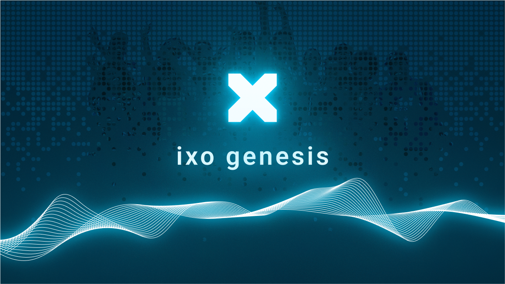

# genesis

 

  

 

The genesis repository provides information to support anyone who wants to run a full node of the [ixo Blockchain](https://github.com/ixofoundation/ixo-blockchain). 

Setup instructions and configuration details for both Testnet and Mainnet can be [found here](./README_CONFIG.md).

The genesis files, installations, and upgrade instructions for the Testnet and Mainnet networks are:

- [pandora-8 (testnet)](./pandora-8/upgrade.md)
- [ixo-5 (mainnet)](./ixo-5/upgrade.md)
